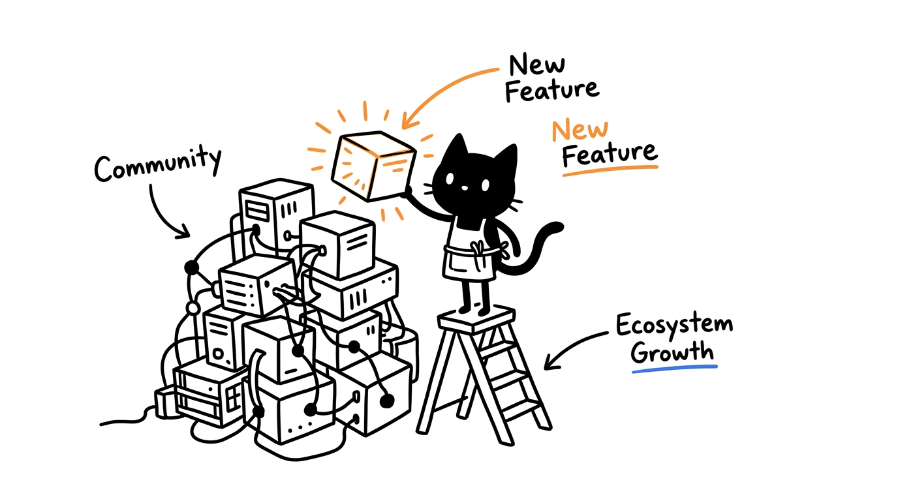

# Contributing to the HeLa MCP Ecosystem

Thank you for your interest in contributing to the **HeLa MCP Ecosystem**! This document provides guidelines and information for contributors and maintainers.



---

## 1. Architectural Boundaries & 10-MCP Ceiling

* **The 10-MCP Capability Ceiling**: The ecosystem maintains exactly 10 canonical MCP servers (7 core headless, 3 specialized GUI/device). Contributions focus on reliability, performance, tool quality, and testing rather than adding new server repositories.
* **The 4-Tier Naming Architecture**:
  * Tier 1: Public Identity (`HeLa <Component>`, e.g. *HeLa Mitosis*, *HeLa Genome*)
  * Tier 2: Machine Identifier (`hela-*`, e.g. `hela-mitosis`, `hela-genome`)
  * Tier 3: Technical Source Repository (`chaining-mcp-server`, `Project-Guardian-mcp-server`, etc.)
  * Tier 4: Immutable Commit Hash (`config/snapshots/v1.0.0.json`)
* **Repository Autonomy**: Upstream repositories remain independent and modular.

---

## 2. Development & Verification Workflow

### 2.1 Local Environment Setup
```bash
git clone https://github.com/1999AZZAR/hela-mcp-ecosystem.git
cd hela-mcp-ecosystem
./setup.sh --profile dev-workspace --client skip --non-interactive
```

### 2.2 Running Diagnostics & Tests
Before submitting changes, ensure all test suites pass locally:

```bash
# 1. Run diagnostic health checks
npm run doctor

# 2. Run 70-combination multi-client matrix tests
npm run test:matrix

# 3. Run master integration test suite (295 tools across all 10 servers)
npm test

# 4. Run pre-commit linters
pre-commit run --all-files
```

---

## 3. Pull Request Guidelines

1. **Target Branch**: Submit all pull requests against the `development` branch.
2. **Commit Conventions**: Follow standard Conventional Commits:
   * `feat(scope): ...`
   * `fix(scope): ...`
   * `docs(scope): ...`
   * `test(scope): ...`
   * `chore(scope): ...`
3. **CI Matrix Conformance**: Ensure GitHub Actions passes across all matrix targets (`ubuntu-latest`, `macos-latest` on Node.js 18, 20, and 22).

---

## 4. Attribution & Recognition

The HeLa project respectfully recognizes **Henrietta Lacks** and the enduring scientific legacy of HeLa cells as an inspiration for immortal, modular cellular architecture in software.
