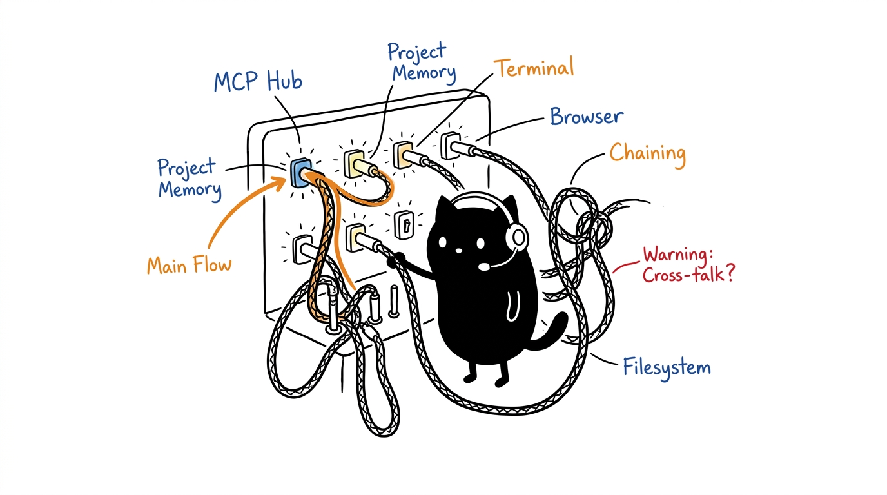
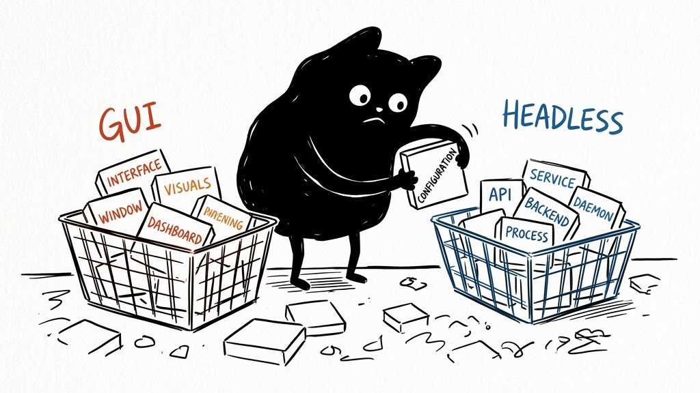
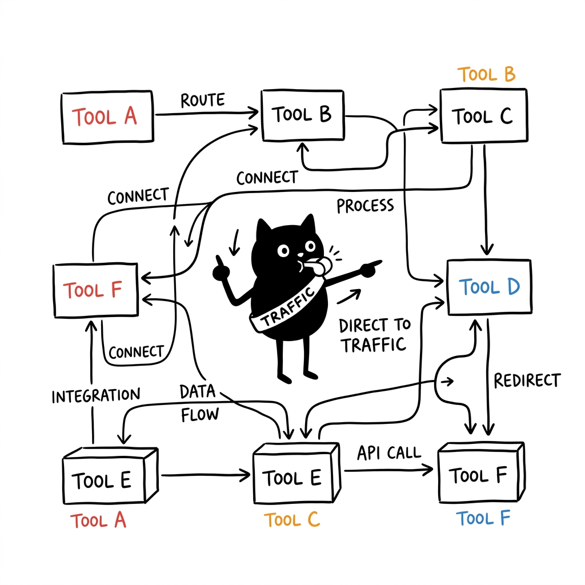
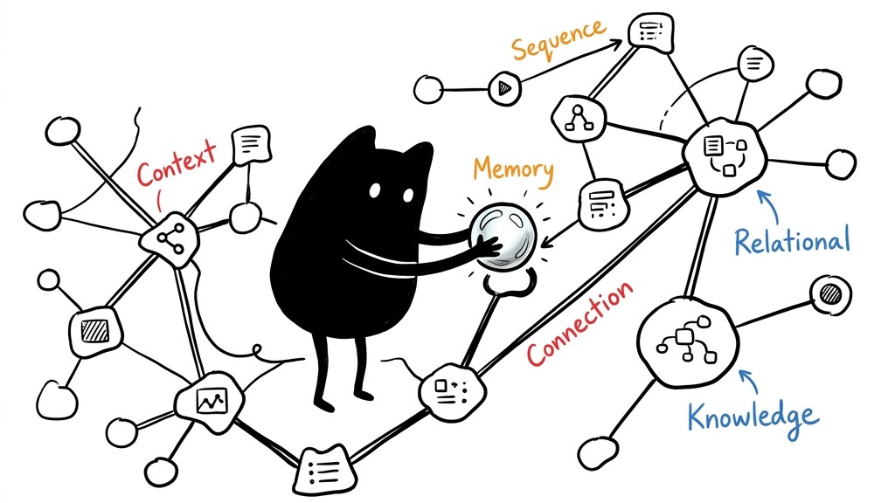

# MCP Ecosystem Suite

A collection of Model Context Protocol (MCP) servers developed by Azzar, designed to enhance AI agent harness capabilities across development, research, project management, and system operations.



## Table of Contents

- [Overview](#overview)
  - [Core Servers](#core-servers)
- [Quick Start](#quick-start)
  - [Prerequisites](#prerequisites)
  - [Installation](#installation)
  - [MCP Client Options](#mcp-client-options)
  - [MCP Client Configuration](#mcp-client-configuration)
    - [For Cursor IDE](#for-cursor-ide)
    - [For Claude Desktop](#for-claude-desktop)
- [Server Details](#server-details)
  - [Chaining MCP Server](#chaining-mcp-server)
  - [Filesystem MCP Server](#filesystem-mcp-server)
  - [Project Guardian MCP Server](#project-guardian-mcp-server)
  - [Terminal MCP Server](#terminal-mcp-server)
  - [Researcher MCP Server](#researcher-mcp-server)
  - [Browser Agent MCP Server](#browser-agent-mcp-server)
- [Development](#development)
  - [Repository Structure](#repository-structure)
  - [Individual Server Development](#individual-server-development)
  - [Building All Servers](#managing-servers-by-scope)
- [Contributing](#contributing)
  - [For New Contributors](#for-new-contributors)
  - [Development Guidelines](#development-guidelines)
  - [Adding New Servers](#adding-new-servers)
- [Documentation](#documentation)
  - [Architecture Guide](docs/architecture.md)
  - [Integration Guide](docs/integration.md)
  - [Troubleshooting Guide](docs/troubleshooting.md)
- [License](#license)
- [Support](#support)
- [Updates](#updates)

## Overview

The MCP Ecosystem Suite provides a profile-driven collection of specialized MCP servers. Instead of installing one fixed stack, you pick a **profile** — a named subset of servers matched to your use case and target system (GUI desktop vs. headless server). Each server focuses on a specific domain while interoperating through the MCP protocol.



See [Profiles](docs/profiles.md) for the full profile reference and custom-profile guide.

### Core Servers

| Server                                                                                  | Purpose                        | Key Features                                                    |
| --------------------------------------------------------------------------------------- | ------------------------------ | --------------------------------------------------------------- |
| [**Chaining MCP**](https://github.com/1999AZZAR/chaining-mcp-server)                 | Intelligent tool orchestration | Route optimization, sequential thinking, workflow orchestration |
| [**Filesystem MCP**](https://github.com/1999AZZAR/filesystem-mcp-server)             | Advanced file operations       | File manipulation, directory operations, search capabilities    |
| [**Project Guardian MCP**](https://github.com/1999AZZAR/Project-Guardian-mcp-server) | Project memory management      | Knowledge graphs, task tracking, database operations            |
| [**Terminal MCP**](https://github.com/1999AZZAR/terminal-mcp-server)                 | System command execution       | Remote execution, session management, cross-platform support    |
| [**Menager MCP**](https://github.com/1999AZZAR/menager-mcp-server)                 | Terminal Orchestration         | Polyglot harness multiplexing, Regex hooks, PTY session management |
| [**Researcher MCP**](https://github.com/1999AZZAR/research-assistant-mcp-server)    | Combined research platform     | Unified Google Search + Wikipedia with additional analysis tools |
| [**Browser Agent MCP**](https://github.com/1999AZZAR/browser-agent)             | Browser automation             | Playwright-based web interaction, scraping, automation          |
| [**The Designer MCP**](https://github.com/1999AZZAR/the-designer)              | UI/UX design tooling           | Style evaluation, tokens, component + Tailwind generation       |
| [**scrcpy MCP**](https://github.com/1999AZZAR/scrcpy-mcp) *(GUI/device)*        | Android device control         | ADB + scrcpy automation, UI inspection, app control             |
| [**LL3M Agent MCP**](https://github.com/1999AZZAR/ll3m-agent) *(GUI)*          | Autonomous 3D modeling         | Blender scene generation, iterative refinement                  |

All servers are listed in `config/inventory.json`; *(GUI)*/*(device)* servers ship only in matching headless-appropriate profiles.

## Quick Start

### Prerequisites

- Node.js >= 18.0.0
- npm or yarn
- Git
- **For Docker option:** Docker and Docker Compose

### Installation

1. **Clone the MCP Ecosystem Suite repository:**

   ```bash
   git clone https://github.com/1999AZZAR/mcp-ecosystem.git
   cd mcp-ecosystem
   ```

2. **Interactive Setup:**

   The setup script will guide you through the installation:

   ```bash
   ./setup.sh
   ```

   **Setup Process:**
   - Checks prerequisites (Node.js, Git)
   - Prompts for target system and use-case **profile**
   - Clones/builds only the servers in that profile
   - Prompts for MCP client selection:
     - **Cursor IDE** - Automatic configuration
     - **Claude Desktop** - Automatic configuration
     - **OpenCode** - Automatic configuration
     - **Docker Compose** - Container setup

### MCP Client Configuration

The example configs below reflect the `dev-workspace` profile. To generate config for a different profile/client, use the generator:

```bash
node scripts/generate-config.mjs <profile> --backend <cursor|claude|opencode|docker>
```

The full, current examples are also checked in as `config/cursor-example.json`, `config/claude-example.json`, and `config/opencode-example.json`.

#### For Cursor IDE

Add the following to your `mcp.json` (the `dev-workspace` profile):

```json
{
  "mcpServers": {
    "chaining": {
      "command": "node",
      "args": ["/absolute/path/to/mcp-ecosystem/chaining-mcp-server/dist/index.js"],
      "env": {
        "SEQUENTIAL_THINKING_AVAILABLE": "true",
        "AWESOME_COPILOT_ENABLED": "true",
        "RELIABILITY_MONITORING_ENABLED": "true",
        "GITHUB_TOKEN": "your-github-token"
      }
    },
    "filesystem": {
      "command": "node",
      "args": ["/absolute/path/to/mcp-ecosystem/filesystem-mcp-server/dist/index.js"]
    },
    "Project-Guardian": {
      "command": "node",
      "args": ["/absolute/path/to/mcp-ecosystem/Project-Guardian-mcp-server/dist/index.js"]
    },
    "terminal": {
      "command": "node",
      "args": ["/absolute/path/to/mcp-ecosystem/terminal-mcp-server/build/index.js"]
    },
    "menager": {
      "command": "node",
      "args": ["/absolute/path/to/mcp-ecosystem/menager-mcp-server/build/index.js"]
    },
    "research": {
      "command": "node",
      "args": ["/absolute/path/to/mcp-ecosystem/research-mcp-server/dist/index.js"],
      "env": {
        "GOOGLE_API_KEY": "your-google-api-key",
        "GOOGLE_CSE_ID": "your-google-cse-id"
      }
    },
    "browser-agent": {
      "command": "node",
      "args": ["/absolute/path/to/mcp-ecosystem/browser-agent/src/server.js"]
    },
    "the-designer": {
      "command": "node",
      "args": ["/absolute/path/to/mcp-ecosystem/the-designer/dist/index.js"]
    }
  }
}
```

#### For Claude Desktop

Add the following to your `claude_desktop_config.json` (the `dev-workspace` profile):

```json
{
  "mcpServers": {
    "chaining": {
      "command": "node",
      "args": ["/absolute/path/to/mcp-ecosystem/chaining-mcp-server/dist/index.js"],
      "env": {
        "SEQUENTIAL_THINKING_AVAILABLE": "true",
        "AWESOME_COPILOT_ENABLED": "true",
        "RELIABILITY_MONITORING_ENABLED": "true",
        "GITHUB_TOKEN": "your-github-token"
      }
    },
    "filesystem": {
      "command": "node",
      "args": ["/absolute/path/to/mcp-ecosystem/filesystem-mcp-server/dist/index.js"]
    },
    "Project-Guardian": {
      "command": "node",
      "args": ["/absolute/path/to/mcp-ecosystem/Project-Guardian-mcp-server/dist/index.js"]
    },
    "terminal": {
      "command": "node",
      "args": ["/absolute/path/to/mcp-ecosystem/terminal-mcp-server/build/index.js"]
    },
    "menager": {
      "command": "node",
      "args": ["/absolute/path/to/mcp-ecosystem/menager-mcp-server/build/index.js"]
    },
    "research": {
      "command": "node",
      "args": ["/absolute/path/to/mcp-ecosystem/research-mcp-server/dist/index.js"],
      "env": {
        "GOOGLE_API_KEY": "your-google-api-key",
        "GOOGLE_CSE_ID": "your-google-cse-id"
      }
    },
    "browser-agent": {
      "command": "node",
      "args": ["/absolute/path/to/mcp-ecosystem/browser-agent/src/server.js"]
    },
    "the-designer": {
      "command": "node",
      "args": ["/absolute/path/to/mcp-ecosystem/the-designer/dist/index.js"]
    }
  }
}
```

#### For OpenCode

OpenCode uses a different schema than Cursor/Claude: servers go under `mcp` with `type: "local"`, a `command` array, and `environment` instead of `env`. Generate it or let `setup.sh` do it:

```bash
node scripts/generate-config.mjs dev-workspace --backend opencode --root /absolute/path/to/mcp-ecosystem --out config/opencode-example.json
```

```json
{
  "mcp": {
    "chaining": {
      "type": "local",
      "enabled": true,
      "command": ["node", "/absolute/path/to/mcp-ecosystem/chaining-mcp-server/dist/index.js"],
      "environment": {
        "SEQUENTIAL_THINKING_AVAILABLE": "true",
        "AWESOME_COPILOT_ENABLED": "true",
        "RELIABILITY_MONITORING_ENABLED": "true",
        "GITHUB_TOKEN": "your-github-token"
      }
    },
    "research": {
      "type": "local",
      "enabled": true,
      "command": ["node", "/absolute/path/to/mcp-ecosystem/research-mcp-server/dist/index.js"],
      "environment": {
        "GOOGLE_API_KEY": "your-google-api-key",
        "GOOGLE_CSE_ID": "your-google-cse-id"
      }
    }
  }
}
```

Merge this `mcp` object into your `~/.config/opencode/opencode.json` (it merges with existing settings rather than replacing them). The full `dev-workspace` example is at `config/opencode-example.json`.

## Server Details

All servers are defined in `config/inventory.json`; a server can be added to any number of profiles. Servers marked **GUI/device** are excluded from headless profiles by default.

### Chaining MCP Server

**Repository:** [chaining-mcp-server](https://github.com/1999AZZAR/chaining-mcp-server)

Intelligent tool orchestration and workflow management server featuring:

- Server discovery and tool analysis
- Route optimization with complexity assessment
- Sequential thinking and brainstorming capabilities
- Multi-server workflow orchestration
- Time zone management and conversion
- Awesome Copilot integration for development guidance



### Filesystem MCP Server

**Repository:** [filesystem-mcp-server](https://github.com/1999AZZAR/filesystem-mcp-server)

Advanced file system operations server providing:

- File and directory operations
- Content reading with encoding support
- File search and filtering capabilities
- Archive creation and extraction
- File system monitoring and change detection

### Project Guardian MCP Server

**Repository:** [Project-Guardian-mcp-server](https://github.com/1999AZZAR/Project-Guardian-mcp-server)

Project memory and knowledge management server featuring:

- Knowledge graph for project entities and relationships
- Task tracking and progress management
- SQLite database operations
- Data import/export capabilities
- Project management workflows



### Terminal MCP Server

**Repository:** [terminal-mcp-server](https://github.com/1999AZZAR/terminal-mcp-server)

System command execution server with:

- Local and remote command execution
- SSH session management
- Cross-platform compatibility
- Command timeout and error handling
- Environment variable support

### Menager MCP Server

**Repository:** [menager-mcp-server](https://github.com/1999AZZAR/menager-mcp-server)

Terminal orchestration server featuring:

- Inter-session terminal orchestration via POSIX pseudo-terminals (`pty`)
- AI agent control plane for spawning, monitoring, and driving child terminal harnesses
- Predictable event interception with non-blocking regex hooks
- Memory-bounded observability with token-efficient circular buffers
- Simulated human typing (text, control sequences, raw keystrokes)

### Researcher MCP Server

**Repository:** [research-assistant-mcp-server](https://github.com/1999AZZAR/research-assistant-mcp-server)

Unified research platform combining Google Search and Wikipedia functionality:

- Combined Google Search and Wikipedia access
- Enhanced analysis tools (sentiment analysis, keyword extraction)
- Research workflow management
- Academic research capabilities
- Multi-source fact checking
- Research session management

### Browser Agent MCP Server

**Repository:** [browser-agent](https://github.com/1999AZZAR/browser-agent)

Browser automation and web interaction server featuring:

- Playwright-based browser automation
- Web scraping and content extraction
- Interactive web navigation
- Form filling and automated actions
- Visual verification and screenshots
- Session management for persistent browsing

### The Designer MCP Server

**Repository:** [the-designer](https://github.com/1999AZZAR/the-designer)

UI/UX design system tooling:

- Style evaluation and best-system recommendation
- Design tokens and Tailwind config generation
- HTML/CSS/React/Vue component generation
- 8-state component demos and accessibility audit
- Pre-flight scanning of existing projects

### scrcpy MCP Server

**Repository:** [scrcpy-mcp](https://github.com/1999AZZAR/scrcpy-mcp)

Android device control (GUI/device target):

- ADB + scrcpy device automation
- UI hierarchy inspection and element control
- App install/launch/stop and file transfer
- Screen recording and screenshots

### LL3M Agent MCP Server

**Repository:** [ll3m-agent](https://github.com/1999AZZAR/ll3m-agent)

Autonomous 3D modeling (GUI target, requires local Blender):

- Blender scene generation via natural language
- Multi-agent iterative refinement
- Mesh/material inspection and rendering

## Development

### Repository Structure

```
mcp-ecosystem/
├── README.md                              # This file
├── CONTRIBUTING.md                      # Contribution guidelines
├── LICENSE                              # MIT License
├── setup.sh                             # Profile-driven setup script
├── update.sh                            # Update servers in a scope
├── config/                              # Server registry + profiles + examples
│   ├── inventory.json                   # All available servers (registry)
│   ├── profiles.json                    # Profile (stack) definitions
│   ├── cursor-example.json              # Generated Cursor config (dev-workspace)
│   ├── claude-example.json              # Generated Claude config (dev-workspace)
│   ├── opencode-example.json            # Generated OpenCode config (dev-workspace)
│   └── docker-compose.yml                # Docker configuration
├── docs/                                # Documentation
│   ├── architecture.md                 # System architecture overview
│   ├── integration.md                  # Comprehensive integration guides
│   ├── profiles.md                     # Profile reference + custom profiles
│   └── troubleshooting.md              # Common issues and solutions
└── scripts/                             # Utility scripts
    ├── generate-config.mjs             # Render profile -> client config
    ├── lib.sh                          # Shared helpers (profiles/inventory/scope)
    ├── build-all.sh                    # Build servers in a scope
    ├── test-all.sh                     # Test servers in a scope
    └── clean-all.sh                    # Clean build artifacts in a scope
```

### Individual Server Development

Each MCP server maintains its own repository for focused development:

1. **Independent Development:** Each server can be developed, tested, and deployed independently
2. **Version Management:** Individual versioning allows for flexible updates and rollbacks
3. **Specialization:** Focused repositories enable domain-specific optimizations
4. **Community Contributions:** Easier for contributors to focus on specific server improvements

### Managing Servers by Scope

Every utility script accepts a scope: the whole inventory, a profile, or explicit keys.

```bash
# Build / test / clean — interactive scope selection
./scripts/build-all.sh
./scripts/build-all.sh --all                    # every server in the inventory
./scripts/build-all.sh --profile research       # only a profile's servers
./scripts/build-all.sh chaining-mcp-server filesystem-mcp-server

# Tests and cleanup use the same flags
./scripts/test-all.sh --profile dev-workspace
./scripts/clean-all.sh --all --full
```

For more information see the [Profiles Guide](docs/profiles.md) and [Development Documentation](docs/integration.md#development-integration).

## Contributing

We welcome contributions to the MCP Ecosystem Suite! See [CONTRIBUTING.md](CONTRIBUTING.md) for detailed guidelines.

## Documentation

For comprehensive documentation, see:

- **[Architecture Guide](docs/architecture.md)** - System architecture, server components, and data flow diagrams
- **[Profiles Guide](docs/profiles.md)** - Profile reference, GUI vs. headless stacks, custom profiles
- **[Integration Guide](docs/integration.md)** - Detailed setup instructions for Cursor IDE, Claude Desktop, and Docker
- **[Troubleshooting Guide](docs/troubleshooting.md)** - Common issues and solutions

## License

The MCP Ecosystem Suite is licensed under the MIT License. See [LICENSE](LICENSE) for details. Individual servers may have their own licenses - please check each repository for specific licensing information.

## Support

- **Issues:** Report bugs and request features in individual server repositories
- **Discussions:** Join community discussions in the respective GitHub repositories
- **Documentation:**
  - Check individual server READMEs for detailed usage instructions
  - See [docs/integration.md](docs/integration.md) for integration help
  - See [docs/troubleshooting.md](docs/troubleshooting.md) for common issues

## Updates

To update servers to their latest versions (use `--all`, `--profile <id>`, or explicit keys, or let the menu prompt you):

```bash
./update.sh                 # interactive scope
./update.sh --all           # every server in the inventory
./update.sh --profile headless-server
```

This pulls the latest changes for the selected servers, reinstalls dependencies, and rebuilds them.

---
