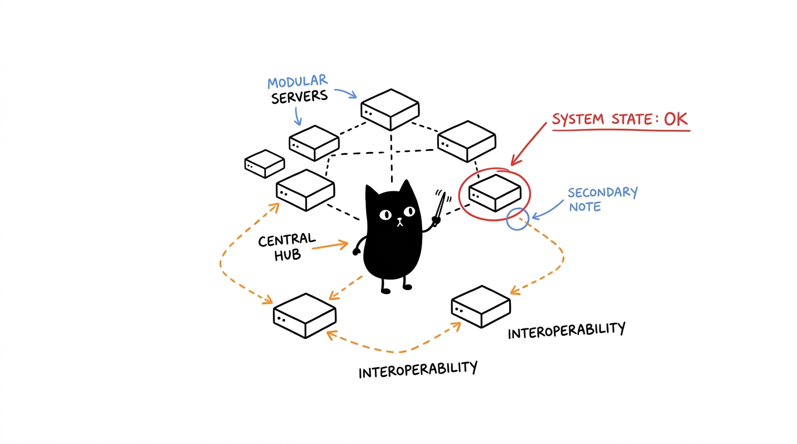

# MCP Ecosystem Suite Architecture


## Table of Contents

- [Overview](#overview)
- [Core Principles](#core-principles)
  - [1. Modularity](#1-modularity)
  - [2. Interoperability](#2-interoperability)
  - [3. Specialization](#3-specialization)
- [Profile-Driven Architecture](#profile-driven-architecture)
  - [Inventory](#inventory)
  - [Profiles](#profiles)
- [Server Architecture](#server-architecture)
  - [The MCP Servers](#the-mcp-servers)
  - [Chaining MCP Server](#chaining-mcp-server)
  - [Filesystem MCP Server](#filesystem-mcp-server)
  - [Project Guardian MCP Server](#project-guardian-mcp-server)
  - [Terminal MCP Server](#terminal-mcp-server)
  - [Researcher MCP Server](#researcher-mcp-server)
  - [Browser Agent MCP Server](#browser-agent-mcp-server)
  - [The Designer MCP Server](#the-designer-mcp-server)
  - [scrcpy MCP Server](#scrcpy-mcp-server)
  - [LL3M Agent MCP Server](#ll3m-agent-mcp-server)
- [Data Flow Architecture](#data-flow-architecture)
  - [Client Interaction Layer](#client-interaction-layer)
  - [Server Orchestration Layer](#server-orchestration-layer)
- [Communication Patterns](#communication-patterns)
  - [1. Direct Tool Calls](#1-direct-tool-calls)
  - [2. Resource Access](#2-resource-access)
  - [3. Workflow Orchestration](#3-workflow-orchestration)
  - [4. Data Persistence](#4-data-persistence)
- [Deployment Architecture](#deployment-architecture)
  - [Development Environment](#development-environment)
  - [Production Environment](#production-environment)
- [Security Considerations](#security-considerations)
  - [1. Access Control](#1-access-control)
  - [2. Data Protection](#2-data-protection)
  - [3. Network Security](#3-network-security)
- [Performance Optimization](#performance-optimization)
  - [1. Caching Strategies](#1-caching-strategies)
  - [2. Resource Management](#2-resource-management)
  - [3. Monitoring](#3-monitoring)
- [Future Extensions](#future-extensions)
  - [Potential New Servers](#potential-new-servers)
  - [Enhanced Orchestration](#enhanced-orchestration)

## Overview

The MCP Ecosystem Suite is a **profile-driven** collection of Model Context Protocol (MCP) servers. Instead of a single fixed stack, servers are registered in an **inventory** (`config/inventory.json`) and grouped into **profiles** (`config/profiles.json`) matched to a use case and target system. Each server focuses on a specific domain while interoperating through the MCP protocol.

## Core Principles

### 1. Modularity
Each MCP server operates independently, allowing for:
- Focused development and maintenance
- Independent deployment and scaling
- Technology stack specialization
- Isolated testing and versioning

### 2. Interoperability
All servers communicate through the standardized MCP protocol, enabling:
- Seamless integration between servers
- Cross-server workflow orchestration
- Unified client configuration
- Consistent API patterns

### 3. Specialization
Each server targets specific use cases:
- **Chaining MCP**: Workflow orchestration and AI guidance
- **Filesystem MCP**: File system operations and management
- **Project Guardian MCP**: Project memory and knowledge management
- **Terminal MCP**: System command execution
- **Researcher MCP**: Combined web research and knowledge access
- **Browser Agent MCP**: Browser automation and web interaction
- **The Designer MCP**: UI/UX design system tooling
- **scrcpy MCP**: Android device control *(GUI/device)*
- **LL3M Agent MCP**: Autonomous 3D modeling in Blender *(GUI)*

## Profile-Driven Architecture

The suite keeps a single registry of servers and a set of curated stacks, rather than one hardcoded "install everything" bundle.

### Inventory
`config/inventory.json` lists every available server with metadata the tooling depends on: Git repository URL, clone directory, entry file, build command (if any), required environment variables, and whether the server needs a GUI or physical device. Adding a new server here makes it available to every profile and to the `--all` scope.

### Profiles
`config/profiles.json` defines named stacks. Each entry picks a **system** (`gui`, `headless`, or `any`) and a `servers` list referencing inventory keys. The setup tool filters profiles by the target system and installs only the selected profile. The built-in `all` profile (system `any`) resolves to every inventory server. See [profiles.md](profiles.md).

## Server Architecture

The MCP Ecosystem Suite covers 9 servers registered in the inventory:

### Chaining MCP Server
**Purpose**: Intelligent tool orchestration and workflow management

**Components**:
- Server Discovery Module: Automatically detects available MCP servers
- Tool Analysis Engine: Analyzes server capabilities and tools
- Route Optimization Algorithm: Determines optimal tool execution paths
- Sequential Thinking Manager: Handles complex problem-solving workflows
- Workflow Orchestrator: Manages multi-server operations
- Time Management System: Handles timezone conversions and scheduling

**Integration Points**:
- Discovers and coordinates all other MCP servers
- Provides high-level orchestration for complex tasks
- Integrates with Awesome Copilot for development guidance

### Filesystem MCP Server
**Purpose**: Advanced file system operations

**Components**:
- File Operations Handler: Basic file CRUD operations
- Directory Management: Folder operations and navigation
- Search Engine: File content and metadata search
- Archive Manager: Compression and extraction utilities
- File Monitor: Change detection and notifications

**Integration Points**:
- Provides file system access to other servers
- Supports data import/export for Project Guardian
- Enables file-based workflows in terminal operations

### Project Guardian MCP Server
**Purpose**: Project memory and knowledge management

**Components**:
- Knowledge Graph Engine: Entity and relationship management
- Memory Manager: Project state persistence and retrieval
- Database Abstraction Layer: SQLite operations and schema management
- Import/Export System: Data transfer between formats
- Search Index: Full-text search across project knowledge

**Integration Points**:
- Stores project context for other servers
- Provides persistent memory for workflow orchestration
- Enables knowledge sharing across development sessions

### Terminal MCP Server
**Purpose**: System command execution and automation

**Components**:
- Command Executor: Local and remote command execution
- SSH Manager: Secure remote session handling
- Session Controller: Persistent connection management
- Output Processor: Command result parsing and formatting
- Security Validator: Command safety and permission checking

**Integration Points**:
- Executes system operations for other servers
- Provides deployment and automation capabilities
- Enables infrastructure management workflows

### Researcher MCP Server
**Purpose**: Unified research platform combining Google Search and Wikipedia functionality

**Components**:
- Combined Search Interface: Unified Google Search and Wikipedia access
- Content Analysis Engine: Advanced content extraction and analysis
- Fact Verification System: Multi-source credibility assessment
- Research Workflow Manager: Coordinated research across sources
- Trend Analysis: Search pattern and interest analysis
- Academic Research Tools: Specialized tools for scholarly research

**Integration Points**:
- Provides comprehensive research capabilities in a single server
- Supports content verification and fact-checking
- Enables web-based and knowledge base research workflows

### Browser Agent MCP Server
**Purpose**: Browser automation and web interaction

**Components**:
- Browser Controller: Playwright-based browser management
- Interaction Engine: Automated clicking, typing, and navigation
- Content Scraper: Intelligent data extraction from web pages
- Session Manager: Persistent browser sessions and cookie handling
- Visual Monitor: Screenshot and visual verification capabilities

**Integration Points**:
- Enables automation of web-based workflows
- Provides real-time web interaction for research and testing
- Complements Researcher MCP by providing interactive capabilities

### The Designer MCP Server
**Purpose**: UI/UX design system and token tooling

**Components**:
- Style Evaluation: Recommends the best design system for a product tone
- Token Generator: Produces design tokens (colors, typography, spacing) and Tailwind configs
- Component Generator: Renders ready-to-paste HTML/React/Vue components
- Accessibility Audit: Runs WCAG checks and flags contrast/labeling issues
- Pre-flight Scanner: Detects framework and token state in an existing project

**Integration Points**:
- Generates styling primitives consumed by frontend/design workflows
- Pairs with Filesystem to write generated component and token files

### scrcpy MCP Server
**Purpose**: Android device control via ADB and scrcpy *(GUI/device)*

**Components**:
- Device Manager: Enumerates connected Android devices
- Input Controller: Tap, swipe, key and text injection
- UI Inspector: Dumps the accessibility tree and locates views
- File Transfer: Push/pull files between host and device
- Media Capture: Screenshots and screen recording

**Integration Points**:
- Enables mobile testing and automation workflows
- Complements Terminal MCP for ADB-based system operations

### LL3M Agent MCP Server
**Purpose**: Autonomous 3D modeling in Blender *(GUI, requires local Blender)*

**Components**:
- Scene Generator: Builds 3D scenes from natural-language prompts
- Planning Agent: Produces multi-component modeling plans
- Refinement Loop: Applies reviewer feedback iteratively to improve mesh quality
- Rendering: Captures screenshots and renders scene output

**Integration Points**:
- Depends on a local Blender installation and a display target
- Complements Filesystem MCP for asset persistence

## Data Flow Architecture

### Client Interaction Layer
```
┌─────────────────┐
│   MCP Client    │ (Cursor IDE, Claude Desktop, OpenCode, etc.)
│                 │
│ • Tool Calls    │
│ • Resource Reads│
│ • Notifications │
└─────────────────┘
         │
    MCP Protocol
         │
```

### Server Orchestration Layer

```text
┌───────────────────────────────────────────────────────────────────────┐
│                         Chaining MCP Server                           │
│  ┌─────────────────────────────────────────────────────────────────┐  │
│  │      Tool Discovery • Route Optimization • Orchestration        │  │
│  └─────────────────────────────────────────────────────────────────┘  │
│              │                        │                    │          │
│      Orchestrates              Coordinates              Manages       │
│              │                        │                    │          │
└───────────────────────────────────────────────────────────────────────┘
         │                        │                          │
         ▼                        ▼                          ▼
┌─────────────────┐      ┌─────────────────┐        ┌─────────────────┐
│ Filesystem MCP  │      │  Researcher MCP │        │The Designer MCP │
│                 │      │                 │        │                 │
│ File Operations │      │ Web+Wikipedia   │        │ UI/UX & Tokens  │
└─────────────────┘      └─────────────────┘        └─────────────────┘
         │                        │                          │
         ▼                        ▼                          ▼
┌─────────────────┐      ┌─────────────────┐        ┌─────────────────┐
│ Project Guardian│      │  Browser Agent  │        │   scrcpy MCP    │
│                 │      │                 │        │                 │
│ Knowledge Mgmt  │      │ Automation      │        │ Android Control │
└─────────────────┘      └─────────────────┘        └─────────────────┘
         │                        │                          │
         ▼                        ▼                          ▼
┌─────────────────┐      ┌─────────────────┐        ┌─────────────────┐
│  Terminal MCP   │      │   External APIs │        │ LL3M Agent MCP  │
│                 │      │                 │        │                 │
│ System Commands │      │ (Google/Web/SSH)│        │ 3D Modeling     │
└─────────────────┘      └─────────────────┘        └─────────────────┘
         │
         ▼
┌─────────────────┐
│  Data Storage   │
│                 │
│ SQLite • Files  │
└─────────────────┘
```

## Communication Patterns

### 1. Direct Tool Calls
Individual servers expose tools that clients can call directly for specific operations.

### 2. Resource Access
Servers provide resources that can be read by clients for accessing cached data, templates, and status information.

### 3. Workflow Orchestration
The Chaining MCP server coordinates complex multi-step operations across multiple servers.

### 4. Data Persistence
Project Guardian provides persistent storage for project state and knowledge across sessions.

## Deployment Architecture

### Development Environment
- Individual server repositories for focused development
- Local MCP client configuration for testing
- Independent build and test pipelines

### Production Environment
- Containerized deployment with Docker
- Orchestrated setup through ecosystem repository
- Centralized configuration management
- Automated update and maintenance scripts

## Security Considerations

### 1. Access Control
- Server-specific API keys (Google Search, etc.)
- Command validation in Terminal MCP
- File system permission checks
- Browser isolation and security policies

### 2. Data Protection
- Secure storage of sensitive configuration
- Input validation and sanitization
- Safe command execution boundaries

### 3. Network Security
- HTTPS-only external API calls
- SSH key management for remote operations
- Rate limiting and abuse prevention

## Performance Optimization

### 1. Caching Strategies
- Tool discovery results caching
- Content caching in search operations
- Session persistence in terminal and browser operations

### 2. Resource Management
- Connection pooling in database operations
- Memory management in large file and browser operations
- Concurrent request handling

### 3. Monitoring
- Performance metrics collection
- Error tracking and reporting
- Resource usage monitoring

## Future Extensions

### Potential New Servers
- **Git MCP**: Version control operations
- **Database MCP**: General database access
- **API MCP**: REST API testing and interaction
- **Documentation MCP**: Code documentation generation
- **Testing MCP**: Automated testing framework integration

### Enhanced Orchestration
- Machine learning-based route optimization
- Predictive tool recommendations
- Automated workflow learning
- Cross-server dependency resolution

This architecture provides a solid foundation for extensible AI agent harness capabilities while maintaining clean separation of concerns and robust interoperability. Because servers are inventory-driven and grouped into profiles, deploying a headless research node vs. a full GUI workstation is just a matter of choosing a different profile.
