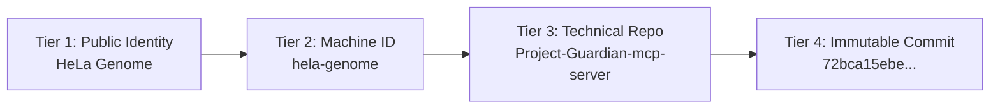
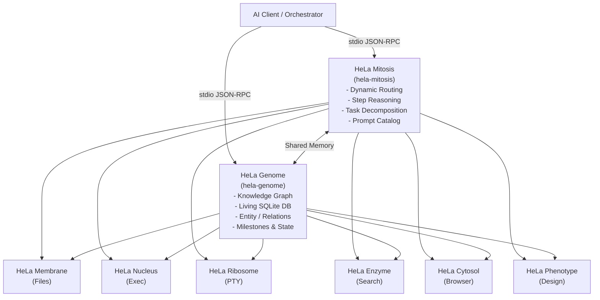
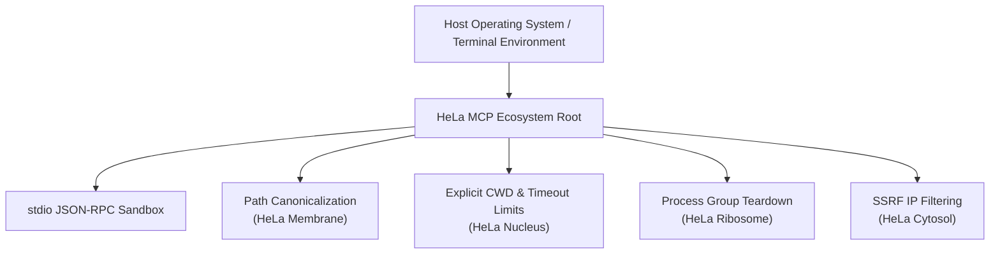

# HeLa MCP Ecosystem Architecture

This document provides a comprehensive architectural reference for the **HeLa MCP Ecosystem**, detailing its cellular design principles, dual-backbone topology, component taxonomies, and cross-MCP communication mechanisms.

---

## 1. Architectural Philosophy: The Cellular Metaphor

The **HeLa MCP Ecosystem** is architected around a cellular biology metaphor, respectfully recognizing **Henrietta Lacks** (1920–1951) and the immortal legacy of HeLa cells in biomedical research:

1. **Cellular Specialization**: In biological systems, organelles perform distinct biochemical functions while cooperating as a unified organism. In the HeLa ecosystem, servers act as specialized cellular components (Nucleus, Membrane, Enzyme, Ribosome, Plastid) coordinated by a dual backbone.
2. **Deterministic Immortality**: Through commit-pinned snapshots (`config/snapshots/v1.0.0.json`) and idempotent setup scripts, an entire multi-server agent harness can be restored in a clean, reproducible state on any host.
3. **Repository Autonomy**: Underlying repositories, Git histories, and package dependencies remain completely autonomous and uncoupled.

---

## 2. The 4-Tier Naming Architecture

To balance brand clarity, backwards compatibility, and technical provenance, the ecosystem enforces a 4-tier naming model:

1. **Tier 1 (Public Identity)**: Clean, uniform human-facing persona name (e.g. *HeLa Mitosis*, *HeLa Genome*, *HeLa Membrane*).
2. **Tier 2 (Machine Identifier)**: Stable hyphenated identifier (`hela-*`) used in configuration files (`mcpServers`), CLI flags, and profile definitions.
3. **Tier 3 (Technical Source Repo)**: Independent Git repository name on GitHub maintaining upstream authorship and commit history.
4. **Tier 4 (Immutable Commit Pin)**: Exact SHA-1 hash recorded in `config/snapshots/` ensuring reproducible builds.

---

## 3. Dual-Backbone Coordination Topology

Every deployed profile in the ecosystem is grounded by a dual backbone:

* **HeLa Mitosis (Routing & Planning Backbone)**: Analyzes client tools, suggests multi-step execution paths, executes multi-branch trees via `sequentialthinking`, and serves 42 curated domain prompts.
* **HeLa Genome (State & Memory Backbone)**: Maintains the living SQLite knowledge graph (`memory.db`), restores cross-session context, records task states, and manages project milestones.

---

## 4. Component Taxonomy

### 4.1 Core Backbone Servers

#### 1. HeLa Mitosis (`hela-mitosis` / `chaining-mcp-server`)
* **Role**: Orchestration, dynamic routing, and step-by-step reasoning.
* **Entrypoint**: `dist/index.js`
* **Tools**: `sequentialthinking`, `analyze_tools`, `generate_route_suggestions`, `llm_decompose_task`, `workflow_orchestrator`.
* **Zero-Key Fallback**: Employs deterministic local heuristic routing (<30ms) when `OPENROUTER_API_KEY` is not provided.

#### 2. HeLa Genome (`hela-genome` / `Project-Guardian-mcp-server`)
* **Role**: Living memory graph, entity-relation-observation state tracking.
* **Entrypoint**: `dist/index.js`
* **Tools**: `create_entity`, `create_relation`, `add_observation`, `read_graph`, `search_nodes`, `get_session_context`, `sync_central_memory`.
* **Storage**: Embedded SQLite database (`memory.db`) with FTS5 full-text indexing.

---

### 4.2 Core Capability Servers

#### 3. HeLa Membrane (`hela-membrane` / `filesystem-mcp-server`)
* **Role**: Sandboxed workspace filesystem operations and search.
* **Entrypoint**: `dist/index.js`
* **Tools**: `read_file`, `write_file`, `find_files`, `search_in_files`, `copy_file`, `move_file`, `delete_file`, `archive_files`.

#### 4. HeLa Nucleus (`hela-nucleus` / `terminal-mcp-server`)
* **Role**: Isolated command execution and RTK token optimization.
* **Entrypoint**: `build/index.js`
* **Tools**: `execute_command`, `transfer_file`, `terminal_ls`, `terminal_grep`, `terminal_cat`.

#### 5. HeLa Ribosome (`hela-ribosome` / `menager-mcp-server`)
* **Role**: Polyglot interactive PTY session multiplexing and Regex hook engine.
* **Entrypoint**: `build/index.js`
* **Tools**: `session_spawn`, `session_write`, `session_read`, `session_hook`, `session_close`, `session_list`, `session_prune`.

#### 6. HeLa Enzyme (`hela-enzyme` / `research-assistant-mcp-server`)
* **Role**: Unified research platform combining Google Custom Search and Wikipedia caching.
* **Entrypoint**: `dist/index.js`
* **Tools**: `google_search`, `wikipedia_search`, `wikipedia_get_summary`, `content_summarizer`, `fact_checker`, `keyword_extraction`.

#### 7. HeLa Cytosol (`hela-cytosol` / `Browser-Agent`)
* **Role**: Playwright-based browser automation and DOM accessibility perception.
* **Entrypoint**: `src/server.js`
* **Tools**: `browser_navigate`, `browser_screenshot`, `browser_click`, `browser_type`, `browser_get_accessibility_tree`, `browser_get_page_markdown`.

---

### 4.3 Specialized Capability Servers

#### 8. HeLa Phenotype (`hela-phenotype` / `the-designer`)
* **Role**: UI/UX design tokens, OKLCH palettes, and Tailwind component synthesis.
* **Entrypoint**: `dist/index.js`
* **Tools**: `generate_tokens`, `generate_tailwind_config`, `palette_fetch`, `audit_accessibility`, `generate_template`.

#### 9. HeLa Receptor (`hela-receptor` / `scrcpy-mcp`)
* **Role**: Android mobile device control via ADB bridge.
* **Entrypoint**: `dist/server.js`
* **Tools**: `start_session`, `ui_dump`, `ui_find_element`, `tap`, `swipe`, `input_text`, `screenshot`.

#### 10. HeLa Plastid (`hela-plastid` / `ll3m-agent`)
* **Role**: Autonomous 3D procedural modeling and rendering in Blender.
* **Entrypoint**: `dist/index.js` (under `brain/`)
* **Tools**: `generate_modeling_plan`, `execute_blender_code`, `render_output`, `save_blend`, `get_fast_feedback`.

---

## 5. Security & Isolation Model

1. **Process Boundary**: Each server runs in an isolated Node.js child process communicating exclusively over standard input/output (`stdio`) via JSON-RPC 2.0 messages.
2. **Memory Safety**: SQLite database operations in `hela-genome` use parameterized queries with WAL (Write-Ahead Logging) mode.
3. **Secret Isolation**: API credentials are never output to stdout or logs. All diagnostics (`./setup.sh doctor`) display masked/presence indicators only.

---

## 6. Profile System & Lifecycle Management

The ecosystem configuration generator (`scripts/generate-config.mjs`) reads:
1. **`config/inventory.json`**: Authoritative component catalog, entrypoints, Git repositories, and alias mappings.
2. **`config/profiles.json`**: Curated stacks tailored to specific agent personas and hardware targets.

When executed, the installer matches the profile's server list against the inventory, checks out the exact pinned commit hashes from `config/snapshots/v1.0.0.json`, and renders the target client's exact syntax (`mcpServers` JSON, TOML, or YAML).
