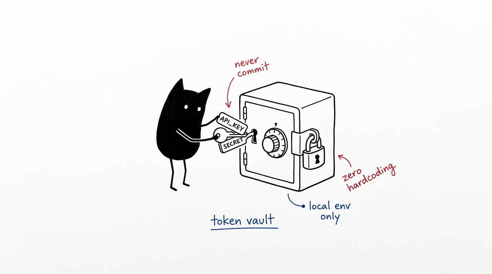

# HeLa MCP Ecosystem: Keys & Secrets Guide



This document explains system prerequisites, all optional API keys/secrets across the **HeLa MCP Ecosystem**, where to acquire them, and how the ecosystem operates in zero-cost, offline fallback modes.

---

## 1. System Prerequisites

Before running setup, ensure your system meets the baseline requirements:

| Prerequisite | Minimum Version | Recommended | Installation Command |
|---|---|---|---|
| **Node.js** | `>= 18.0.0` | `20.x` or `22.x` LTS | `curl -fsSL https://deb.nodesource.com/setup_20.x \| sudo -E bash - && sudo apt-get install -y nodejs` |
| **npm** | `>= 8.0.0` | `>= 10.0.0` | Bundled with Node.js (`npm install -g npm@latest`) |
| **Git** | `>= 2.25.0` | Latest | `sudo apt install git` / `brew install git` |
| **SQLite3** | `>= 3.30.0` | Latest | Bundled with system / `sudo apt install sqlite3` |
| **Docker** *(Optional)* | `>= 20.10.0` | Latest with Compose v2 | `sudo apt install docker-compose-plugin` |

---

## 2. Keys & Secrets Catalog

All keys and secrets in this ecosystem are **100% OPTIONAL**. The entire suite is engineered with graceful degradation and offline fallbacks. You can run all servers out of the box with zero keys.

```
┌────────────────────────────────────────────────────────────────────────┐
│                        HELA MCP KEY MATRIX                             │
├───────────────────────┬──────────────────────┬─────────────┬───────────┤
│ Secret Name           │ Target Component     │ Necessity   │ Fallback  │
├───────────────────────┼──────────────────────┼─────────────┼───────────┤
│ OPENROUTER_API_KEY    │ HeLa Mitosis         │ Optional    │ Heuristic │
│ GITHUB_TOKEN          │ HeLa Mitosis         │ Optional    │ Bundled   │
│ GOOGLE_API_KEY        │ HeLa Enzyme          │ Optional    │ Wikipedia │
│ GOOGLE_CSE_ID         │ HeLa Enzyme          │ Optional    │ Wikipedia │
└───────────────────────┴──────────────────────┴─────────────┴───────────┘
```

---

### 1. `OPENROUTER_API_KEY`

* **Target Component**: **HeLa Mitosis** (`hela-mitosis` / `chaining-mcp-server`)
* **Purpose**: Powers dynamic LLM intelligence for task decomposition (`llm_decompose_task`), AI route ranking (`llm_suggest_route`), and query routing (`llm_query`).
* **Where to get it**:
  1. Visit [OpenRouter API Keys](https://openrouter.ai/keys).
  2. Create a free account.
  3. Generate an API key (`sk-or-v1-...`).
  4. *Note*: OpenRouter provides free models (e.g. `openrouter/free`) that do not require paid credits.
* **If you DO NOT have it**:
  * **Consequence**: The server will not make external LLM calls.
  * **Fallback Behavior**: `hela-mitosis` automatically and instantly falls back to its deterministic local heuristic optimizer. `llm_suggest_route` returns heuristic rankings in `<30ms`, `llm_decompose_task` returns rule-based subtasks, and `llm_summarize` performs local text compression. Zero crashes, zero process hangs.

---

### 2. `GITHUB_TOKEN`

* **Target Component**: **HeLa Mitosis** (`hela-mitosis` / `chaining-mcp-server`)
* **Purpose**: Synchronizes the latest community prompt collections, guidelines, and chatmodes from GitHub repositories at runtime.
* **Where to get it**:
  1. Visit [GitHub Personal Access Tokens](https://github.com/settings/tokens).
  2. Generate a token with public read-only access.
* **If you DO NOT have it**:
  * **Consequence**: Live GitHub syncing is disabled.
  * **Fallback Behavior**: The server operates 100% offline from its bundled local catalog (42 pre-indexed instructions). `search_instructions` and `load_instruction` respond in `<1ms`.

---

### 3. `GOOGLE_API_KEY` & `GOOGLE_CSE_ID`

* **Target Component**: **HeLa Enzyme** (`hela-enzyme` / `research-assistant-mcp-server`)
* **Purpose**: Live web search queries via the Google Custom Search JSON API.
* **Where to get them**:
  1. **API Key**: Create an API key at [Google Cloud Console](https://console.cloud.google.com/apis/credentials). Enable the *Custom Search API* (100 free searches/day).
  2. **CSE ID**: Create a Search Engine ID at [Programmable Search Engine](https://programmablesearchengine.google.com/controlpanel/all) (set Search the entire web = ON).
* **If you DO NOT have them**:
  * **Consequence**: Live Google search queries will return a configuration notice.
  * **Fallback Behavior**: Wikipedia search, article summaries, deep-content extraction, multi-language pages, keyword extraction, and sentiment analysis work 100% without keys.

---

## 3. Configuration & Diagnostics

### Initial Setup
Run the setup script:
```bash
./setup.sh
```
The wizard interactively asks for your keys (with an option to press `Enter` to skip and use offline defaults).

### Reconfiguring Keys Anytime
To update keys or change clients on an installed ecosystem:
```bash
./setup.sh --reconfigure
```

### Safe Diagnostic Health Check
To verify your environment and check which fallbacks are active without exposing keys in logs:
```bash
./setup.sh doctor
```
