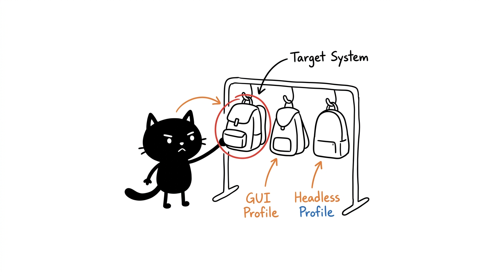

# HeLa MCP Ecosystem — Profile & Agent Persona Catalog

The HeLa MCP Ecosystem organizes capabilities into **agent-oriented profiles**. Each profile pairs the two foundational backbone servers (**HeLa Mitosis** for orchestration and **HeLa Genome** for persistent state) with a tailored set of specialized capability servers.

---

## The Backbone Foundation

Every profile in the ecosystem includes the core dual backbone:

* **HeLa Mitosis (`hela-mitosis` / `chaining-mcp-server`)**: Intelligent tool discovery, route ranking, sequential thinking, task decomposition, and workflow orchestration.
* **HeLa Genome (`hela-genome` / `Project-Guardian-mcp-server`)**: Living SQLite knowledge graph (`memory.db`), task tracking, architectural decisions, and cross-session context restoration.

---

## Profile Catalog

### 1. `dev-workspace` — HeLa Dev Workspace

* **Target System:** GUI / Desktop Workstation
* **Agent Persona:** Full-Stack Software Engineer & Desktop Workstation Agent
* **Purpose:** Complete autonomous software development, testing, UI design, and browser verification.
* **Included Servers (8 Servers):**
  * Backbone: `HeLa Mitosis` (`hela-mitosis`), `HeLa Genome` (`hela-genome`)
  * Workspace: `HeLa Membrane` (`hela-membrane`), `HeLa Nucleus` (`hela-nucleus`), `HeLa Ribosome` (`hela-ribosome`)
  * Knowledge: `HeLa Enzyme` (`hela-enzyme`)
  * Design & Web: `HeLa Phenotype` (`hela-phenotype`), `HeLa Cytosol` (`hela-cytosol`)
* **Standard Workflow:**
  1. Genome restores project history and open tasks.
  2. Mitosis decomposes feature requirements into steps.
  3. Membrane and Nucleus inspect code, run builds, and execute tests.
  4. Phenotype generates design tokens and Tailwind components.
  5. Cytosol validates web UI visually via Playwright.
  6. Genome records decisions, test results, and observations.

---

### 2. `headless-server` — HeLa Headless Server (Core 7)

* **Target System:** Headless Linux Server / CI/CD Runner / Remote VM
* **Agent Persona:** Cloud Infrastructure, Headless Server & CI/CD Automation Agent
* **Purpose:** Autonomous server management, CI/CD pipeline execution, background harness orchestration, and repository maintenance without requiring display servers.
* **Included Servers (7 Servers):**
  * Backbone: `HeLa Mitosis` (`hela-mitosis`), `HeLa Genome` (`hela-genome`)
  * Workspace: `HeLa Membrane` (`hela-membrane`), `HeLa Nucleus` (`hela-nucleus`), `HeLa Ribosome` (`hela-ribosome`)
  * Knowledge: `HeLa Enzyme` (`hela-enzyme`)
  * Design: `HeLa Phenotype` (`hela-phenotype`)
* **Standard Workflow:**
  1. Genome restores environment state.
  2. Mitosis plans deployment or maintenance sequence.
  3. Ribosome spawns and monitors long-running background PTY tasks.
  4. Nucleus executes terminal commands and RTK-optimized queries.
  5. Enzyme researches technical documentation or package dependencies.
  6. Genome tracks task completion.

---

### 3. `research` — HeLa Research Terminal

* **Target System:** Headless / Desktop
* **Agent Persona:** Deep Research Investigator & Technical Knowledge Synthesizer
* **Purpose:** Multi-source research, web scraping, literature analysis, fact-checking, and structured documentation generation.
* **Included Servers (5 Servers):**
  * Backbone: `HeLa Mitosis` (`hela-mitosis`), `HeLa Genome` (`hela-genome`)
  * Knowledge: `HeLa Enzyme` (`hela-enzyme`)
  * Workspace: `HeLa Membrane` (`hela-membrane`)
  * Interaction: `HeLa Cytosol` (`hela-cytosol`)
* **Standard Workflow:**
  1. Genome restores research topic and prior facts.
  2. Mitosis constructs research query plan.
  3. Enzyme queries Google Search and Wikipedia.
  4. Cytosol extracts full article content from web pages.
  5. Membrane writes research synthesis to markdown files.
  6. Genome stores discovered facts into the knowledge graph.

---

### 4. `web-devops` — HeLa Web Dev + Browser Automation

* **Target System:** GUI / Desktop
* **Agent Persona:** Frontend Engineer & Web Verification Specialist
* **Purpose:** Frontend component creation, design token synchronization, automated browser testing, and visual regression checking.
* **Included Servers (6 Servers):**
  * Backbone: `HeLa Mitosis` (`hela-mitosis`), `HeLa Genome` (`hela-genome`)
  * Workspace: `HeLa Membrane` (`hela-membrane`), `HeLa Nucleus` (`hela-nucleus`)
  * Design: `HeLa Phenotype` (`hela-phenotype`)
  * Interaction: `HeLa Cytosol` (`hela-cytosol`)
* **Standard Workflow:**
  1. Genome restores frontend specifications.
  2. Phenotype generates OKLCH tokens and Tailwind configuration.
  3. Membrane creates component files.
  4. Nucleus starts local development server.
  5. Cytosol navigates, interacts, and captures screenshot verification.
  6. Genome records UI validation results.

---

### 5. `android-testing` — HeLa Android Testing Rig

* **Target System:** GUI / Mobile Automation Host (requires `adb` and USB/Wi-Fi connected device)
* **Agent Persona:** Mobile QA Tester & Android Device Automation Engineer
* **Purpose:** Mobile application testing, UI interaction, ADB automation, and mobile debugging.
* **Included Servers (5 Servers):**
  * Backbone: `HeLa Mitosis` (`hela-mitosis`), `HeLa Genome` (`hela-genome`)
  * Workspace: `HeLa Nucleus` (`hela-nucleus`)
  * Mobile: `HeLa Receptor` (`hela-receptor`)
  * Knowledge: `HeLa Enzyme` (`hela-enzyme`)
* **Standard Workflow:**
  1. Genome restores issue ticket.
  2. Nucleus inspects build outputs and logcat streams.
  3. Receptor connects to device, inspects UI XML tree, and executes tap/swipe gestures.
  4. Enzyme investigates error codes or crash logs.
  5. Genome records reproduction steps and bug resolution.

---

### 6. `3d-modeling` — HeLa 3D / Blender Station

* **Target System:** GUI / Workstation (requires local Blender 3.6+ installation)
* **Agent Persona:** Generative 3D Artist & Blender Scene Architect
* **Purpose:** Autonomous 3D modeling, procedural mesh generation, material assignment, scene composition, and rendering in Blender.
* **Included Servers (5 Servers):**
  * Backbone: `HeLa Mitosis` (`hela-mitosis`), `HeLa Genome` (`hela-genome`)
  * 3D: `HeLa Plastid` (`hela-plastid`)
  * Workspace: `HeLa Membrane` (`hela-membrane`), `HeLa Nucleus` (`hela-nucleus`)
* **Standard Workflow:**
  1. Genome restores 3D project requirements.
  2. Mitosis breaks down 3D asset generation stages.
  3. Plastid generates and executes Python scripts inside Blender.
  4. Membrane saves generated `.blend` scene and rendered `.png` images.
  5. Genome records asset metadata and scene relations.

---

### 7. `all` — HeLa All (Full 10-MCP Stack)

* **Target System:** Any / Fully-Equipped Workstation
* **Agent Persona:** Complete HeLa Autonomous Engineering Multi-Agent Stack
* **Purpose:** Unrestricted access to all 10 servers in the ecosystem.
* **Included Servers (10 Servers):**
  * `hela-mitosis`, `hela-genome`, `hela-membrane`, `hela-nucleus`, `hela-ribosome`, `hela-enzyme`, `hela-cytosol`, `hela-phenotype`, `hela-receptor`, `hela-plastid`

---

## Profile Compatibility Matrix

| Profile ID | Target System | Total Servers | Backbone Servers | Headless Compatible | Requires External Runtime / Device |
|---|---|:---:|:---:|:---:|---|
| `dev-workspace` | GUI / Desktop | 8 | Mitosis + Genome | Yes (Playwright) | Playwright / Chromium |
| `headless-server` | Headless | 7 | Mitosis + Genome | Yes | None |
| `research` | Headless / GUI | 5 | Mitosis + Genome | Yes | None |
| `web-devops` | GUI / Desktop | 6 | Mitosis + Genome | Yes (Playwright) | Playwright / Chromium |
| `android-testing` | Device Host | 5 | Mitosis + Genome | No | `adb` + Android Device |
| `3d-modeling` | Workstation | 5 | Mitosis + Genome | No | Blender CLI |
| `all` | Full Host | 10 | Mitosis + Genome | Partial | Playwright, `adb`, Blender |
