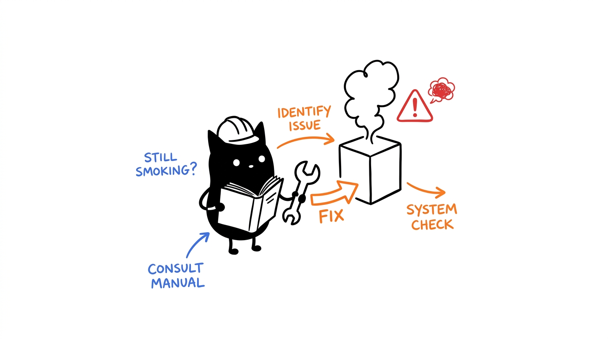

# HeLa MCP Ecosystem Troubleshooting & Diagnostic Guide

This guide provides systematic diagnostic procedures, error code explanations, and recovery workflows for the **HeLa MCP Ecosystem**.



---

## 1. Fast Diagnostic Workflow: `setup.sh doctor`

Before manual debugging, always run the automated diagnostic health check:

```bash
./setup.sh doctor
# or
npm run doctor
```

To run diagnostics against a specific profile:
```bash
./setup.sh doctor --profile dev-workspace
```

To output machine-readable JSON:
```bash
./setup.sh doctor --json
```

### Understanding Diagnostic Output

* **`[READY]`**: The server directory exists, Git commit matches pinned revision, entrypoint is compiled, and stdio JSON-RPC initialization succeeded in <300ms.
* **`[OPTIONAL MISSING]`**: An optional external driver (e.g. Playwright, ADB, Blender) is not installed on the host. Non-core profiles will continue to work normally.
* **`[WARNING]`**: The server is runnable but may differ from the pinned snapshot commit or has uncommitted development changes.
* **`[ERROR - REQUIRED MISSING]`**: A core component or prerequisite failed. Review the actionable recovery steps below.

---

## 2. Common Issues & Recovery Procedures

### 2.1 Diagnostic Failure: Missing Entrypoint or Build Artifacts

**Symptom**: `[ERROR] Entrypoint file missing` or `dist/index.js not found`.

**Root Cause**: The TypeScript source code has not been compiled into JavaScript build artifacts.

**Fix**:
```bash
# Rebuild all 10 servers automatically
npm run build:all

# Or build a single server manually
cd <server-directory>
npm run build
```

---

### 2.2 Server Stdio JSON-RPC Hang or Crash

**Symptom**: `[ERROR] Exited early with code 1` or tool timeouts during execution.

**Root Cause**: Node module dependencies are missing, or environment variables are malformed.

**Fix**:
```bash
# Reinstall dependencies for the failing server
cd <server-directory>
rm -rf node_modules package-lock.json
npm install
npm run build
```

Verify stdio responsiveness manually:
```bash
node <entrypoint-file>
# The process should listen on stdin without throwing an uncaught exception. Press Ctrl+C to exit.
```

---

### 2.3 Client Does Not Recognize Configured MCP Servers

**Symptom**: Cursor, Claude, Gemini, or Zed reports that tools are not available.

**Root Cause**: Configuration file was written to the wrong path, contains relative paths, or the client was not restarted.

**Fix**:
1. **Regenerate configuration with absolute paths**:
   ```bash
   ./setup.sh --reconfigure --profile dev-workspace --client cursor --non-interactive
   ```
2. **Verify target configuration file**:
   * **Cursor IDE**: `cat ~/.cursor/mcp.json`
   * **Claude Desktop**: `cat ~/.claude.json`
   * **Gemini / Antigravity**: `cat ~/.gemini/antigravity-cli/mcp_config.json`
   * **OpenCode**: `cat ~/.config/opencode/opencode.json`
   * **Kilo CLI**: `cat ~/.config/kilo/config.json`
   * **Zed Editor**: `cat ~/.config/zed/settings.json`
   * **Codex / ChatGPT**: `cat ~/.codex/config.toml`
3. **Restart the AI Client / IDE**: MCP clients load server definitions only at startup. Fully restart the application after updating configs.

---

### 2.4 Pinned Snapshot Recovery & Rollback

**Symptom**: Upstream repository changes broke a server build or altered expected tool schemas.

**Root Cause**: Moving `main`/`master` branch contains unreleased or breaking changes.

**Fix**:
Restore known-good, audited release snapshot:
```bash
./setup.sh --snapshot v1.0.0 --profile dev-workspace --non-interactive
```

---

### 2.5 SQLite Database Lock or Corruption (`HeLa Genome`)

**Symptom**: `database is locked` or `SQLite error` in `Project-Guardian-mcp-server`.

**Root Cause**: Multiple concurrent processes accessed `memory.db` without WAL mode enabled, or an ungraceful shutdown occurred.

**Fix**:
1. Verify database integrity using the SQLite CLI:
   ```bash
   sqlite3 <server-dir>/memory.db "PRAGMA integrity_check;"
   ```
2. Enable Write-Ahead Logging (WAL) for robust concurrent reads/writes:
   ```bash
   sqlite3 <server-dir>/memory.db "PRAGMA journal_mode=WAL;"
   ```
3. If corrupted, restore from automated daily backups:
   ```bash
   cp <server-dir>/memory.db.bak <server-dir>/memory.db
   ```

---

### 2.6 External Hardware Driver Issues

#### HeLa Receptor (Android / ADB)
* **Verify ADB availability**: `adb version`
* **Verify device connectivity**: `adb devices` (ensure device is authorized with USB debugging enabled).

#### HeLa Cytosol (Browser Automation)
* **Install Playwright browsers**:
  ```bash
  npx playwright install chromium
  ```

#### HeLa Plastid (Blender 3D)
* **Verify Blender CLI in PATH**:
  ```bash
  blender --version
  ```
* If installed outside standard PATH, create a symlink:
  ```bash
  sudo ln -s /path/to/blender /usr/local/bin/blender
  ```

---

## 3. Getting Further Support

* **Run Integration Tests**: `npm test` (executes 295 tool discovery tests across all 10 servers).
* **Run Matrix Tests**: `npm run test:matrix` (verifies all 70 client configuration combinations).
* **File an Issue**: Open an issue on GitHub at [`https://github.com/1999AZZAR/hela-mcp-ecosystem/issues`](https://github.com/1999AZZAR/hela-mcp-ecosystem/issues) with the output of `./setup.sh doctor --json`.
