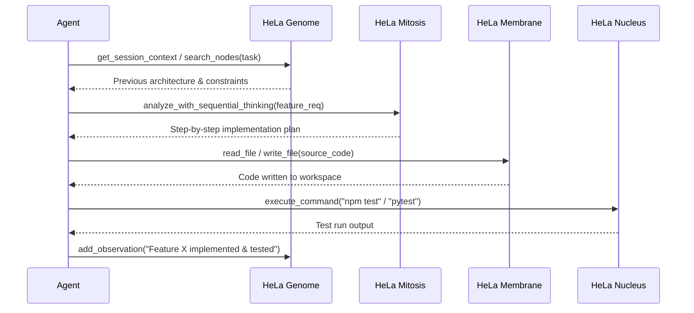
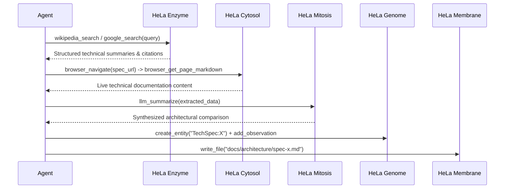
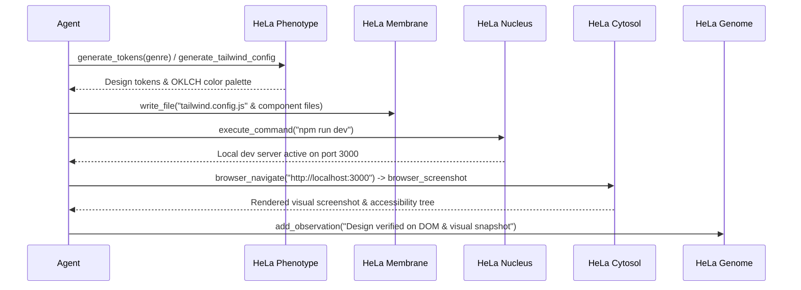
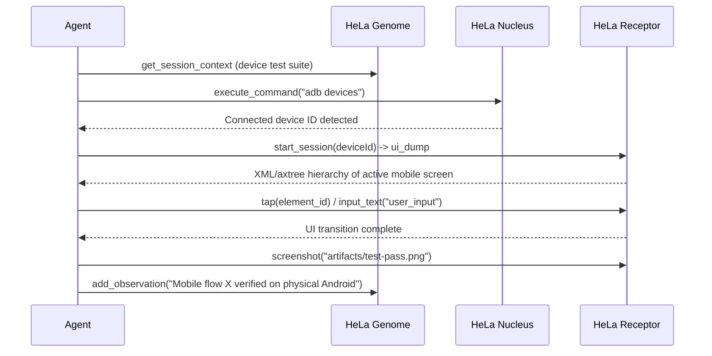
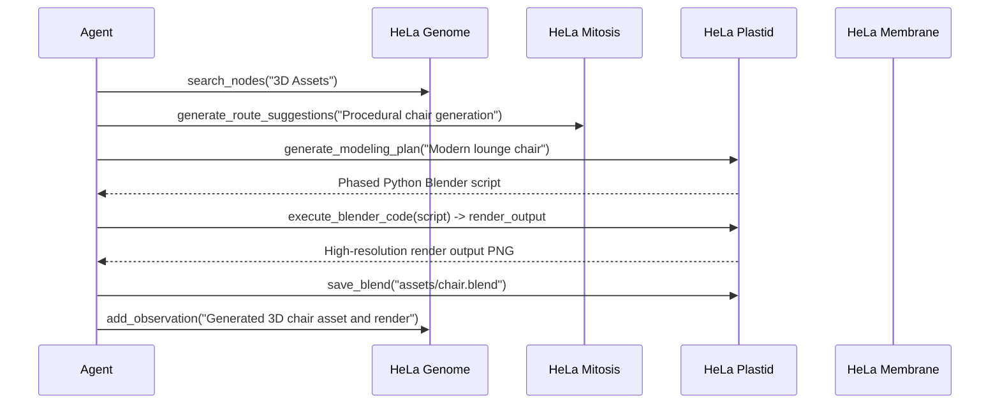
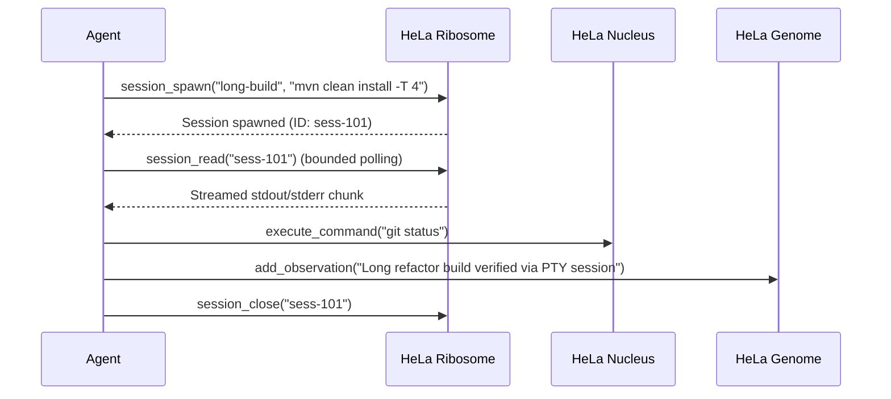

# HeLa MCP Ecosystem: Workflows & Integration Guide

This document defines the standard operational workflows and cross-MCP coordination patterns enabled by the **HeLa MCP Ecosystem**.

---

## 1. Architectural Foundation: Dual-Backbone Coordination

Every profile in the HeLa MCP Ecosystem is anchored by two coordinating backbone servers:

```
                  ┌─────────────────────────────────┐
                  │    Agent / LLM Orchestrator     │
                  └───────────────┬─────────────────┘
                                  │
         ┌────────────────────────┴────────────────────────┐
         │                                                 │
         ▼                                                 ▼
┌──────────────────┐                              ┌──────────────────┐
│   HeLa Mitosis   │                              │   HeLa Genome    │
│  (Orchestrator)  │                              │ (State & Memory) │
├──────────────────┤                              ├──────────────────┤
│ • Dynamic Routing│                              │ • Knowledge Graph│
│ • Step Reasoning │◄────── Shared Context ──────►│ • Entities/Relns │
│ • Tool Planning  │                              │ • Observations   │
└────────┬─────────┘                              └────────┬─────────┘
         │                                                 │
         └────────────────────────┬────────────────────────┘
                                  │
               Dispatches to Specialized Capability Cells
                                  │
    ┌──────────────┬──────────────┼──────────────┬──────────────┐
    ▼              ▼              ▼              ▼              ▼
[Membrane]     [Nucleus]      [Ribosome]      [Enzyme]      [Cytosol]
Workspace FS   Command Exec   PTY Harness    Research/Wiki   Browser DOM
```

- **HeLa Mitosis (`hela-mitosis`)**: Acts as the cognitive orchestrator. It decomposes complex prompts, analyzes tool performance, and runs `sequentialthinking` step-by-step logic.
- **HeLa Genome (`hela-genome`)**: Acts as the immutable project memory. It stores entities, relations, observations, and session milestones in `memory.db`.

---

## 2. Canonical Workflows Catalog

### Workflow A: Autonomous Feature Engineering

**Primary Profiles**: `dev-workspace`, `headless-server`
**Components**: `hela-genome` → `hela-mitosis` → `hela-membrane` → `hela-nucleus` → `hela-genome`



#### Step-by-Step Tool Sequence:
1. **Context Restoration**: Call `get_session_context` on `hela-genome` to retrieve active architectural decisions and dependencies.
2. **Decomposition**: Call `llm_decompose_task` or `sequentialthinking` on `hela-mitosis` to generate an execution plan.
3. **Workspace Modification**: Call `read_file` and `write_file` on `hela-membrane` to apply minimal, production-ready code changes.
4. **Validation**: Call `execute_command` on `hela-nucleus` (or `rtk` wrapper) to run automated unit tests.
5. **State Recording**: Call `add_observation` and `create_relation` on `hela-genome` to commit progress to the knowledge graph.

---

### Workflow B: Deep Research & Architecture Synthesis

**Primary Profiles**: `research`, `dev-workspace`
**Components**: `hela-enzyme` → `hela-cytosol` → `hela-mitosis` → `hela-genome` → `hela-membrane`



#### Step-by-Step Tool Sequence:
1. **Knowledge Retrieval**: Query `wikipedia_search` or `google_search` via `hela-enzyme` for background literature and reference APIs.
2. **Live Web Extraction**: Use `browser_navigate` and `browser_get_page_markdown` via `hela-cytosol` to extract documentation from official docs sites.
3. **Synthesis**: Run `llm_summarize` and `analyze_with_sequential_thinking` on `hela-mitosis` to synthesize key architectural trade-offs.
4. **Knowledge Ingestion**: Call `create_entity` and `create_relation` on `hela-genome` linking findings to existing system components.
5. **Artifact Generation**: Save the final report using `write_file` on `hela-membrane`.

---

### Workflow C: End-to-End Web Feature with Design & Browser Verification

**Primary Profiles**: `web-devops`, `dev-workspace`
**Components**: `hela-phenotype` → `hela-membrane` → `hela-nucleus` → `hela-cytosol` → `hela-genome`



#### Step-by-Step Tool Sequence:
1. **Design System Token Generation**: Call `generate_tokens`, `palette_fetch`, or `generate_tailwind_config` on `hela-phenotype`.
2. **Component Implementation**: Write JSX/Tailwind files using `write_file` on `hela-membrane`.
3. **Dev Server Launch**: Launch background local web server using `execute_command` on `hela-nucleus`.
4. **Visual & Accessibility Verification**: Navigate to `http://localhost:3000` via `browser_navigate` on `hela-cytosol`, verify DOM via `browser_get_accessibility_tree`, and take visual snapshot with `browser_screenshot`.
5. **Milestone Recording**: Save verification screenshot path and milestone to `hela-genome`.

---

### Workflow D: Mobile App Test Automation & Verification

**Primary Profiles**: `android-testing`, `all`
**Components**: `hela-genome` → `hela-nucleus` → `hela-receptor` → `hela-genome`



#### Step-by-Step Tool Sequence:
1. **Device Discovery**: Call `device_list` on `hela-receptor` or `execute_command("adb devices")` on `hela-nucleus`.
2. **Session Initialization**: Call `start_session` on `hela-receptor`.
3. **UI Hierarchy Inspection**: Call `ui_dump` or `ui_find_element` to inspect Android view hierarchy token-efficiently via XML rather than screenshots.
4. **Interaction**: Execute `tap`, `input_text`, `scroll`, or `key_event` to execute test scenario.
5. **Visual Proof & Persistence**: Call `screenshot` and record test result observation in `hela-genome`.

---

### Workflow E: Autonomous 3D Asset Creation & Render Pipeline

**Primary Profiles**: `3d-modeling`, `all`
**Components**: `hela-genome` → `hela-mitosis` → `hela-plastid` → `hela-membrane` → `hela-genome`



#### Step-by-Step Tool Sequence:
1. **Asset Requirement Analysis**: Retrieve scene requirements from `hela-genome`.
2. **Plan Synthesis**: Call `generate_modeling_plan` on `hela-plastid`.
3. **Procedural Execution**: Run `execute_blender_code` to generate geometry, apply materials, and setup lights.
4. **Render Output**: Trigger `render_output` and `get_fast_feedback` for visual QA.
5. **Persistence**: Save `.blend` file via `save_blend` and register the asset entity in `hela-genome`.

---

### Workflow F: Long-Horizon Complex Refactor with PTY Harness

**Primary Profiles**: `dev-workspace`, `headless-server`
**Components**: `hela-ribosome` → `hela-nucleus` → `hela-genome`



#### Step-by-Step Tool Sequence:
1. **Interactive Session Creation**: Call `session_spawn` on `hela-ribosome` for interactive, long-running processes (compilers, debuggers, REPLs).
2. **Session Monitoring**: Read process output with `session_read` or send input with `session_write`.
3. **Session Termination**: Clean up process with `session_close`.
4. **Memory Recording**: Log completed refactor state to `hela-genome`.

---

## 3. Best Practices & Token Economy

1. **Structured Memory Over Raw History**: Always record key findings and milestones to `hela-genome` so subsequent agent turns do not need to re-read thousands of lines of raw logs.
2. **Hierarchy Inspection Over Full Screenshots**: For web (`hela-cytosol`) and mobile (`hela-receptor`), prefer accessibility trees and XML dumps for element location, reserving bitmap screenshots for final visual verification.
3. **Fail-Fast Pre-Validation**: Always verify prerequisite binary availability via `./setup.sh doctor` before launching complex cross-MCP pipelines.
